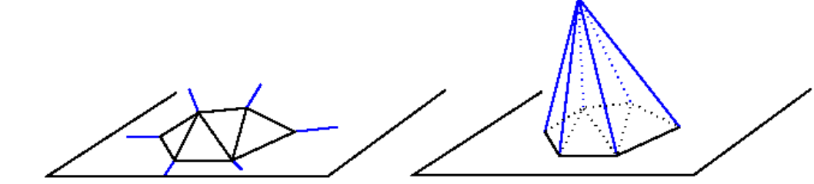
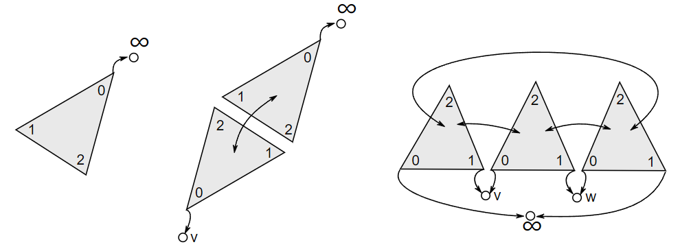

# 二维三角剖分

这一章节描述CGAL二维三角剖分。定义章节回顾三角剖分的定义。表述章节讨论CGAL二维三角剖分的方法。软件设计章节呈现二维三角剖分包的整体软件设计架构。下一章节呈现不同的二维三角剖分类，包括：基本三角剖分，德劳内三角剖分，常规三角剖分，约束三角剖分和受约束的德劳内三角剖分。约束与子约束之间的双向映射的约束三角化描述了一个实现实现受约束或受约束德劳内三角化的类，该类使用附加的数据结构来描述约束是如何通过三角剖分的边缘进行细化的。三角剖分层次结构描述了一种快速点位查询的层级数据结构。灵活性章节解释了用户如何从CGAL三角剖分的灵活性中受益，CGAL三角剖分如何自定义面和顶点类。

## 定义

一个二维的三角剖分可以被大致定义为一系列的三角面T满足：

* 两个三角面要么不相交，要么共享一条低纬度的面（边或点）。
* 面集T中的面连接表示的是毗邻关系。
* T中三角面域 $U_T$没有奇异性。

对于n维空间单纯形定义为：
$$
E =\begin{Bmatrix}p = s_{0}a_{0}+s_{1}a_{1}+...s_{n}a_{n}|s_{0}+s_{1}+...s_{n} = 1,s_{i}\ge 0\end{Bmatrix}\\
\begin{Bmatrix} a_{1}-a_{0}, a_{2}-a_{0}, ... , a_{n-1}-a_{0}, a_{n}-a_{0} \end{Bmatrix} 线性无关\\
a_{i}\in \Re ^{n} ,s_{i}\in \Re
$$

如取二维空间三个向量 $a_{0},a_{1},a_{2}$，和常数$s_{0}, s_{1}, s_{2}$，则单纯形$E= \begin{Bmatrix}p = s_{0}a_{0}+s_{1}a_{1}+s_{2}a_{2}|s_{0}+s_{1}+s_{2} = 1,s_{i}\ge 0\end{Bmatrix}$。

其中 
$$
p = s_{0}a_{0}+s_{1}a_{1}+s_{2}a_{2}
$$
从两种角度可以理解公式，$s_{i}$是向量权重值，表示里向量$a_{i}$尖端的占比。所以在二维空间中的单纯形为一个二维空间三角形。同理可以推理得到一维空间的单纯形为线段、三维空间的的单纯形为四面体。

具体而言，一个三角剖分问题可以被描述未一个`` 单纯复形``.。首先让我们回顾一下几个定义：

``单纯复形``是一个T集合的``单纯形``满足：

**纯粹性**：T中的单纯形的任意面都在T中

**连接性**：T中两个单纯形要么不相交，要么共享一条低纬边

**单纯复形的维度**为单纯复形的单纯形的最大维度，即：$dim= max \begin{Bmatrix}dim\delta  \end{Bmatrix}$,其中$dim\delta$是单纯形的维度。

由三角面T构成的面域$U_T$内，如果存在一个点，其周围未构成拓扑关系，则称该点为**奇异点**。

所以二维三角化可以被描述为一个纯粹的、具有连接线的并且无奇异点的单纯复形问题。

## 表示

### 面集

CGAL的二维三角剖分可以理解为一个基于有界三角形面并且三角形面覆盖了所有点集的凸包的平面分割问题。单个无界三角形为点集凸包的补集。

在许多算法应用中，如 ``Kirkpatrick's hierarchy`` 或者``incremental Delaunay construction``，可以处理但三角面的情况，由于引入了了无穷点和无穷边的概念，同时无穷面也通过上述概念引入。无穷边通过一个无穷点和凸包点构成，无穷面由无穷点和凸包边构成。

因此三角剖分的每个边可以精确的由两个面构成，并且三角剖分的面集合等价于一个二维球。

这可以也可以简单的处理低维退化问题，或者说当三角剖分顶点数少于三个顶点时，此时就是一个一维空间三角化，此时无穷面和线拓扑边构成了一个1维球。当只有一个顶点时，其面域简化一个顶点，引入两个拓扑无穷点此时构成了下右图的0维球。

