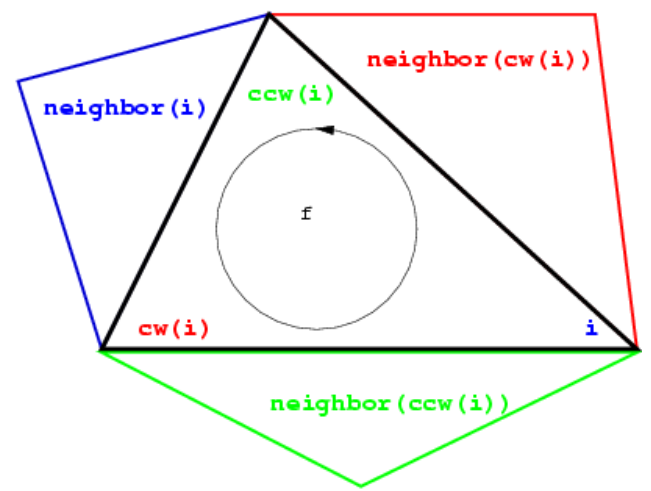
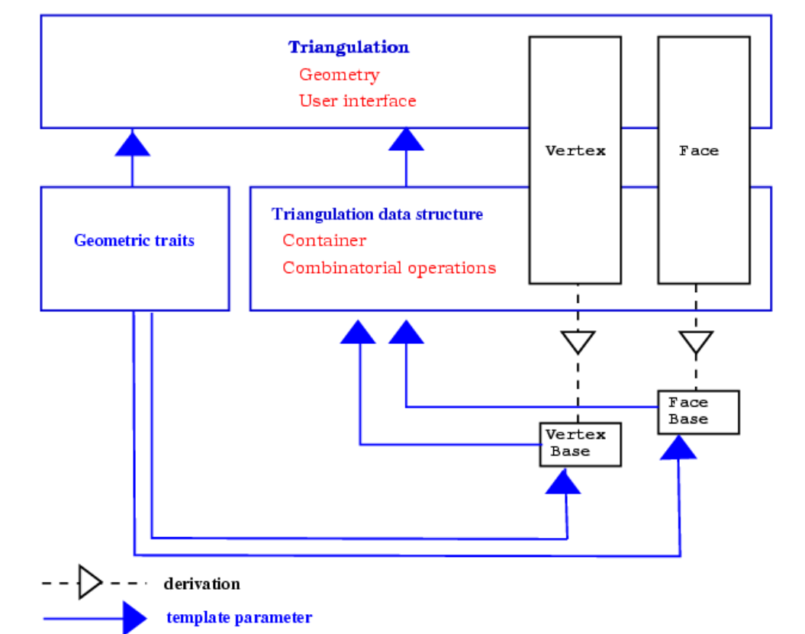

# 二维三角剖分

这一章节描述CGAL二维三角剖分。定义章节回顾三角剖分的定义。表述章节讨论CGAL二维三角剖分的方法。软件设计章节呈现二维三角剖分包的整体软件设计架构。下一章节呈现不同的二维三角剖分类，包括：基本三角剖分，德劳内三角剖分，常规三角剖分，约束三角剖分和受约束的德劳内三角剖分。约束与子约束之间的双向映射的约束三角化描述了一个实现实现受约束或受约束德劳内三角化的类，该类使用附加的数据结构来描述约束是如何通过三角剖分的边缘进行细化的。三角剖分层次结构描述了一种快速点位查询的层级数据结构。灵活性章节解释了用户如何从CGAL三角剖分的灵活性中受益，CGAL三角剖分如何自定义面和顶点类。

## 定义

一个二维的三角剖分可以被大致定义为一系列的三角面T满足：

* 两个三角面要么不相交，要么共享一条低纬度的面（边或点）。
* 面集T中的面连接表示的是毗邻关系。
* T中三角面域 $U_T$没有奇异性。

对于n维空间单纯形定义为：
$$
E =\begin{Bmatrix}p = s_{0}a_{0}+s_{1}a_{1}+...s_{n}a_{n}|s_{0}+s_{1}+...s_{n} = 1,s_{i}\ge 0\end{Bmatrix}\\
\begin{Bmatrix} a_{1}-a_{0}, a_{2}-a_{0}, ... , a_{n-1}-a_{0}, a_{n}-a_{0} \end{Bmatrix} 线性无关\\
a_{i}\in \Re ^{n} ,s_{i}\in \Re
$$

如取二维空间三个向量 $a_{0},a_{1},a_{2}$，和常数$s_{0}, s_{1}, s_{2}$，则单纯形$E= \begin{Bmatrix}p = s_{0}a_{0}+s_{1}a_{1}+s_{2}a_{2}|s_{0}+s_{1}+s_{2} = 1,s_{i}\ge 0\end{Bmatrix}$。

其中 
$$
p = s_{0}a_{0}+s_{1}a_{1}+s_{2}a_{2}
$$
从两种角度可以理解公式，$s_{i}$是向量权重值，表示里向量$a_{i}$尖端的占比。所以在二维空间中的单纯形为一个二维空间三角形。同理可以推理得到一维空间的单纯形为线段、三维空间的的单纯形为四面体。

具体而言，一个三角剖分问题可以被描述未一个`` 单纯复形``.。首先让我们回顾一下几个定义：

``单纯复形``是一个T集合的``单纯形``满足：

纯粹性：T中的单纯形的任意面都在T中

连接性：T中两个单纯形要么不相交，要么共享一条低纬边

单纯复形的维度为单纯复形的单纯形的最大维度，即：$dim= max \begin{Bmatrix}dim\delta  \end{Bmatrix}$,其中$dim\delta$是单纯形的维度。

由三角面T构成的面域$U_T$内，如果存在一个点，其周围未构成拓扑关系，则称该点为奇异点。

所以二维三角化可以被描述为一个纯粹的、具有连接线的并且无奇异点的单纯复形问题。

## 表示

### 面集

CGAL的二维三角剖分可以理解为一个基于有界三角形面并且三角形面覆盖了所有点集的凸包的平面分割问题。单个无界三角形为点集凸包的补集。

在许多算法应用中，如 ``Kirkpatrick's hierarchy`` 或者``incremental Delaunay construction``，可以处理但三角面的情况，由于引入了了无穷点和无穷边的概念，同时无穷面也通过上述概念引入。无穷边通过一个无穷点和凸包点构成，无穷面由无穷点和凸包边构成。

因此三角剖分的每个边可以精确的由两个面构成，并且三角剖分的面集合等价于一个二维球。

这可以也可以简单的处理低维退化问题，或者说当三角剖分顶点数少于三个顶点时，此时就是一个一维空间三角化，此时无穷面和线拓扑边构成了一个1维球。当只有一个顶点时，其面域简化一个顶点，引入两个拓扑无穷点此时构成了下右图的0维球。

### 基于点和面的表示方法

~~对于固定尺寸的单纯复形，三角剖分的面是一个三角面集，所以三角剖分不能以单纯的平面作为实现~~，CGAL使用基于顶点和面而不是边来表示三角剖分，这种表示方法可以节省存储空间并且能够加块算法速度。

三角剖分描述的基本元素是点和面。每个三角面可以访问三个顶点和相邻接面。每个顶点可以访问附着的面之一，通过环形面索引列表。

面的三个顶点序号以逆时针0、1、2索引。相邻接的面有时通过0、1、2索引。可以通过i来访问索引，图中$ccw(i)$和$cw(i)$是计算$i+1$和$i-1$对3取模。

其边不会显式的表达，而是通过面的邻接关系进行隐式的表达。每个边可以隐式的表达为：面f相对于的顶点索引$i$，也可以表达为面f与相邻面$neighbor(i)$的邻接边。

## 软件设计

CGAL三角剖分类提供了一些顶层集合接口，例如三角剖分点位置、嵌入、移除和点置换。他们是基于三角剖分数据结构。三角剖分数据结构可以被认为是三角剖分面和顶点的容器。数据结构也关心三角剖分组合问题。

将几何和组合分开反应在三角剖分类的两个模板参数：

* 第一个参数表示几何萃取，提供了几何图元（点、线段和三角形）和这些元素的元素操作（谓语和构造）。
* 第二个参数表示一个三角数据结构类。三角剖分数据结构定义了用来表示三角剖分顶点和面的类，和额外的类（``handles``、``iterators``、``circulators``）来访问遍历顶点和面。

CGAL提供一个`` `Triangulation_data_structure_2<Vb,Fb>` ``作为三角剖分数据结构模型。`` `Triangulation_data_structure_2<Vb,Fb>` ``有两个模板参数，分别表示顶点和面类。顶点和面可以继承，以实现自己的数据结构。该数据模板参数用来表示三角剖分数据结构的组合信息。

## 基本三角剖分

### 描述

类``Triangulation_2<Traits,Tds>``作为其他三角剖分算法类的基类，通过继承实现用户三角剖分接口。

顶点和面可以通过``handles``、``terators``i和``circulators``。``handle``只提供基本的*和->方法。``circulator``表示访问循环数列。``Handles``访问的数据不是``ciculator``数列的一部分。``iterators``和``circulators``被用来访问三角剖分的全部或部分。

### 实现

定位是通过``stochastic walk``实现的。其 最糟糕的情况时间复杂度为$O(n)$，平均时间复杂度为$O(\sqrt{n} )$。``Triangulation_hierarchy_2<Traits,Tds>``类描述了三角剖分层级，其定为三角剖分数据结构提供了更高效 的点定位算法。

插入点是通过定位一个面包含了该点，并将该面划分成三个新三角面。如果点落在凸包外部，则三角剖分通过反转重新存储，插入操作时间复杂度为$O(1)$。

移除点是通过移除所有相邻接的三角形，并且对洞重新三角化。

位移点，首先确认位移后是否还在原来的三角形面内，如果还在则只需要更新一下顶点位置，否则需要先插入点，然后删除原来的点。

